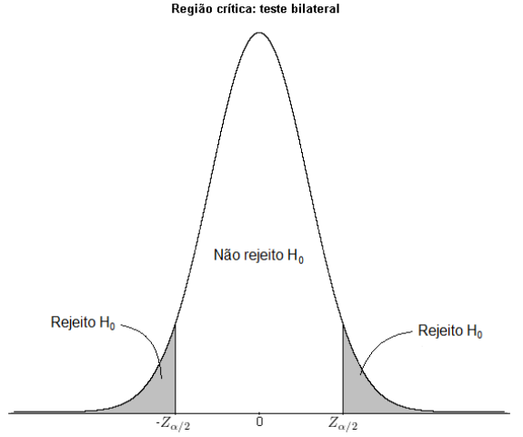
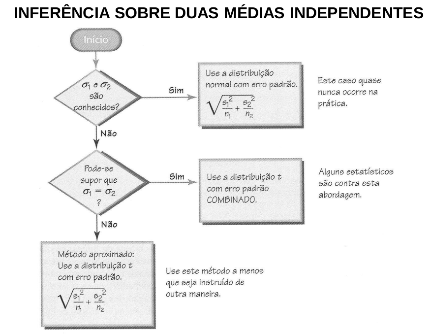
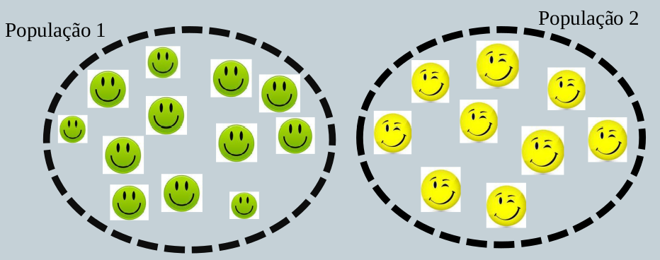

## Teste de Hipóteses.

Em estatística, uma hipótese é uma afirmação sobre uma propriedade da população. Um teste de hipótese (ou teste de significância) é um procedimento para se testar uma afirmativa sobre uma popriedade da população.

```{r, echo=FALSE, out.width = "45%", fig.align='center'}
 
```


## Comparação de Duas Populações: Amostras Independentes

Neste caso, temos duas amostras independentes, **X<sub>1</sub>**, ..., **X<sub>n</sub>** e **Y<sub>1</sub>**, ..., **Y<sub>m</sub>**, de duas populações **P<sub>1</sub>** e **P<sub>2</sub>**, respectivamente.

Estaremos interessados em comparar as médias dessas populações, verificando se elas podem ser consideradas iguais ou não.

O próximo slide resume os métodos para inferência sobre médias de duas populações independentes.

## 

```{r, echo=FALSE, out.width = "70%", fig.align='center'}
 
```


## Requisitos

- Os dois desvios-padrão populacionais não são conhecidos, mas supõe-se que sejam iguais, isto é, \(\sigma_{1}\) = \(\sigma_{2}\).
- As duas amostras são independentes.
- Ambas as amostras são *amostras aleatórias simples*.
- Uma ou as duas condições seguintes são satisfeitas: Os dois tamanhos amostrais são ambos *grandes* (com n<sub>1</sub> > 30 e n<sub>2</sub> > 30), ou ambas as amostras provêm de populações com distibuições normais. (Para pequenas amostras, a exigência de normalidade é relaxada, no sentido de que os procedimentos funcionam bem desde que não haja *outliers* e os desvios da normalidade naõ sejam extremos.)

## Amostras Independentes

- Definição:
  
  Duas amostras são *independentes* se os valores amostrais de uma população não estão relacionados ou, de alguma forma, emparelhados ou combinados com os valores amostrais selecionados da outra população.
  
## \(\sigma_1\) e \(\sigma_2\) Desconhecidos e Iguais

– Se valores de σ<sub>1</sub> e σ<sub>2</sub> não forem conhecidos, mas se for razoável supor que tenham o mesmo valor, as variâncias amostrais podem ser combinadas para estimar σ<sup>2</sup>.

– A estimativa combinada de σ<sup>2</sup> é denotada por s<sub>p</sub><sup>2</sup> .

## Amostra Aleatória Simples

Uma amostra aleatória simples é um subconjunto de indivíduos (a amostra) seleccionado totalmente ao acaso a partir de um conjunto maior (a população) por um processo que garanta que:

- Todos os indivíduos da população têm a mesma probabilidade de ser escolhidos para a amostra; e

- Cada subconjunto possível de indivíduos (amostra) tem a mesma probabilidade de ser escolhido que qualquer outro subconjunto de indivíduos.

```{r, echo=FALSE, out.width = "70%", fig.align='center'}
 
```


## Estatística de Teste

$$
t = \frac{(\bar{x}_1 - \bar{x}_2) - (\mu_1 - \mu_2)}{\sqrt{\frac{s_p²}{n_1} + \frac{s_p²}{n_2}}}
$$
Onde temos a variância combinada:

$$
s_p² = \frac{(n_1 - 1)s_1² + (n_2 - 1)s_2²}{(n_1 - 1) + (n_2 - 1)}  \textrm{(Variância combinada)}
$$
e o número de graus de liberdade é dado por gl \(= n_1 + n_2 - 2\).


## Intervalo de Confiança

O intervalo de confiança para \(\mu_1\) – \(\mu_2\)  com amostras independentes e com \(\sigma_1\) e \(\sigma_2\) iguais é:

$$
(\bar{x}_1 - \bar{x}_2) - E < (\mu_1 - \mu_2) < (\bar{x}_1 - \bar{x}_2) + E
$$

em que 

$$
E = t_{\alpha/2}\sqrt{\frac{s_p²}{n_1} + \frac{s_p²}{n_2}}
$$

e s<sub>p</sub><sup>2</sup> é como dado na estatística de teste acima e o número de graus de liberdade é gl \(=n_1 + n_2 - 2\).


## Exemplo 

Em estudo comparativo do tempo médio de adaptação, uma amostra aleatória, de 50 homens e 50 mulheres de um grande complexo industrial, produziu os seguintes resultados:

```{r, echo=FALSE}
library(knitr)
library(kableExtra)
data <- c(3.2, 3.7, 0.8, 0.9)
table <- matrix(data, ncol = 2, byrow = TRUE)
colnames(table) <- c("Homens", "Mulheres")
rownames(table) <- c("Média", "Desvio padrão")
kable(table) %>%
  kable_styling(fixed_thead = T)

``` 


- Que conclusões você poderia tirar para a população dessa indústria? Quais suposições você deve fazer?


## Exemplo 

- Queremos determinar se há diferença entre o tempo de adaptação de homens e mulheres. Devemos supor que o tempo de adaptação tem distribuição Normal. A amostra foi colhida de maneira
independente. As variâncias populacionais, ainda que desconhecidas, sejam as mesmas.

- Queremos testar a hipótese que as médias são iguais, isto é, \(H_0: \mu_h = \mu_m\), ou equivalentemente, \(H_0: \mu_h - \mu_m = 0\). Note que as suposições acima podem (ou melhor, devem) todas ser verificadas através de testes de hipótese específicos.


## Exemplo

- O teste T com variâncias iguais mas desconhecidas é baseado na seguinte estatística:
$$
t_{cal} = \frac{(\bar{x}_1 - \bar{x}_2) - (\mu_1 - \mu_2)}{\sqrt{\frac{s_p²}{n_1} + \frac{s_p²}{n_2}}} \sim t_{(n_h + n_m-2_)}
$$

- Onde s<sub>p</sub>, o desvio padrão comum é dado por:
$$
s_p² = \frac{(n_h - 1)s_h² + (n_m - 1)s_m²}{(n_h - 1) + (n_m - 1)}  
$$

- No problema apresentado, \(s_p = 0.8514\).


## Exemplo

- A estatística observada foi:
$$
t_{cal} = \frac{(3.2 - 3.7)}{\sqrt{\frac{0.8514}{50} + \frac{0.8514}{50}}} = -2.9363
$$

- Note que a região crítica agora é dada por:
$$
RC[0.05] = {[T < -1.984]\cup[T > 1.984]}
$$
onde \(q = -1.984\) é o ponto tal que \(P([T < q]) = 0.025\).

- E como \(−2.9363 ∈ RC\), rejeitamos a hipótese nula. Ou seja, há evidência em favor da diferença entre o tempo médio de adaptação dos homens e das mulheres.

## Obrigado

```{r, echo=FALSE, out.width = "70%", fig.align='center'}
 
```


## Referências

- 


